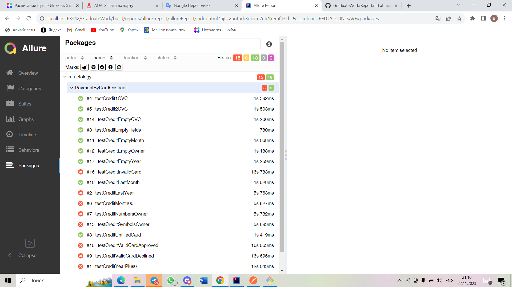
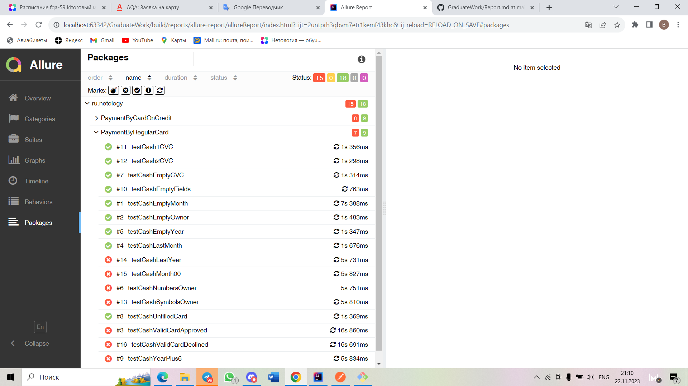
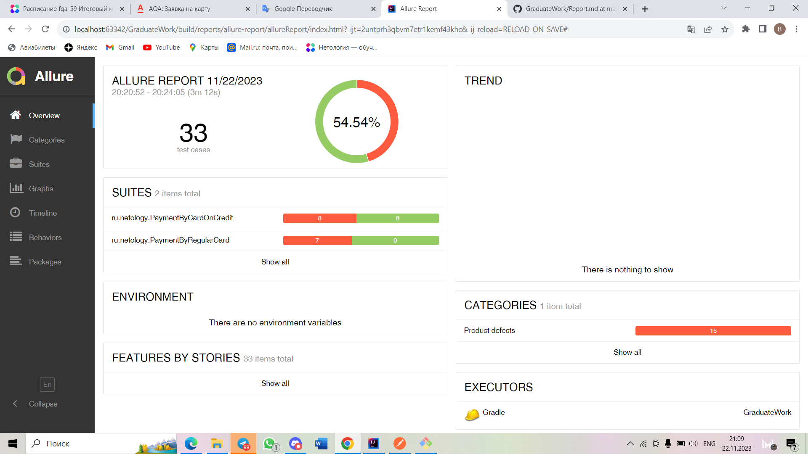

# 1. Отчет по итогам тестирования

В данном проекте было проведено тестирование функциональности веб-приложения. 
Основной целью тестирования была проверка корректной работы основных функций приложения и выявление возможных дефектов.

# 2. Количество выполненных тест кейсов:

Всего было выполнено 33 тест-кейсов, охватывающих различные сценарии использования приложения.

# 3. Процент успешных и неуспешных тест-кейсов:

Из общего числа выполненных тестов 18 завершились успешно, что составляет приблизительно 55% от общего количества 
тест-кейсов. 15 тестов завершились с ошибками, что составляет приблизительно 45% от общего количества тест-кейсов.

# 4. Рекомендации:

* Создать документацию с подробным описанием функциональности приложения и инструкциями по тестированию. Это поможет 
  облегчить работу тестировщиков и повысить понимание особенностей приложения.

* Изменить имена ошибок для полей в многих полях, так как текущие имена не всегда отражают суть проблемы. Например, 
  заменить "Неверный формат" на "Некорректный ввод данных" или "Неправильное значение".

* Необходимо улучшить обработку ошибок и предоставление пользователю информативных сообщений о возникающих проблемах. 
  Это поможет снизить количество неуспешных тест-кейсов и повысить удовлетворенность пользователей приложением.